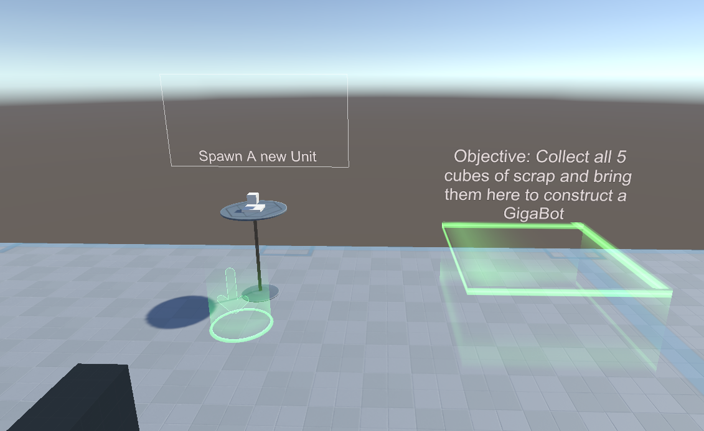
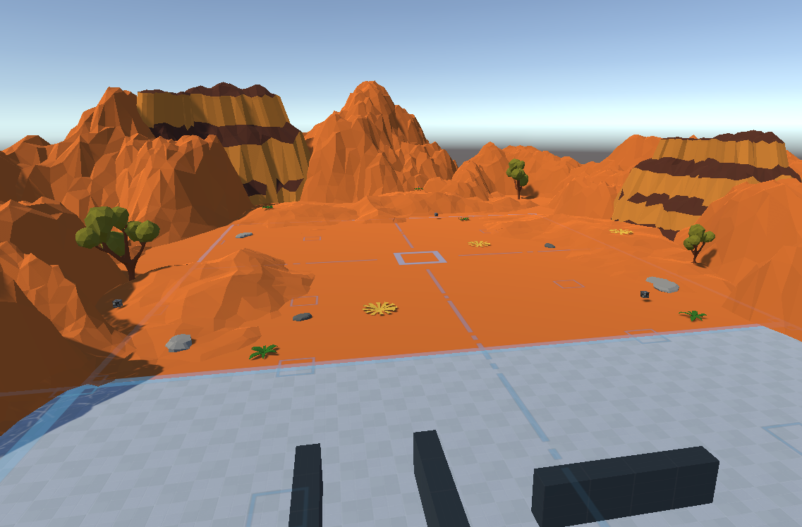
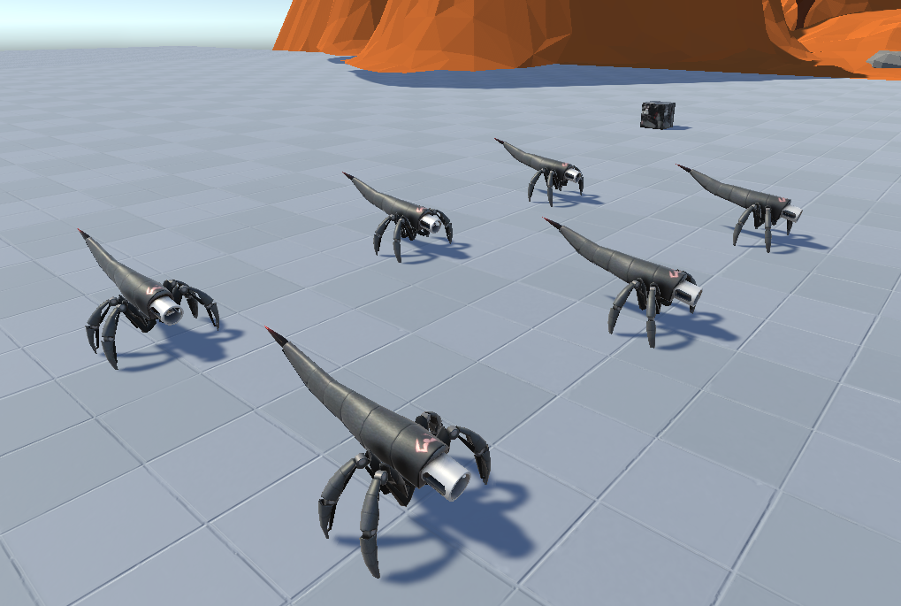
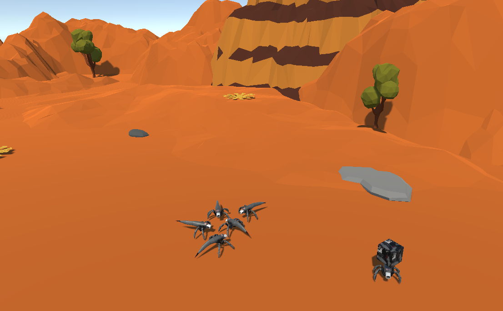
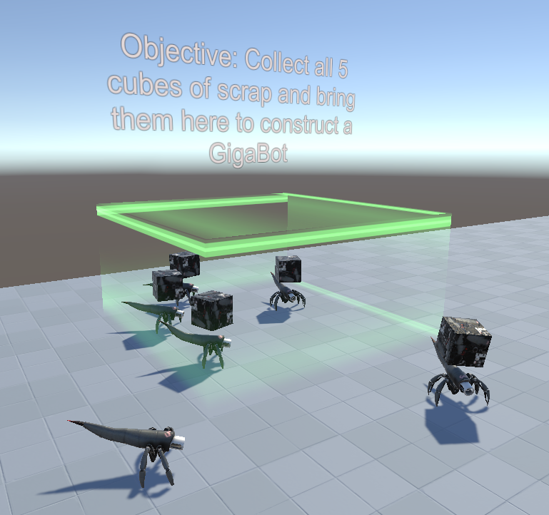
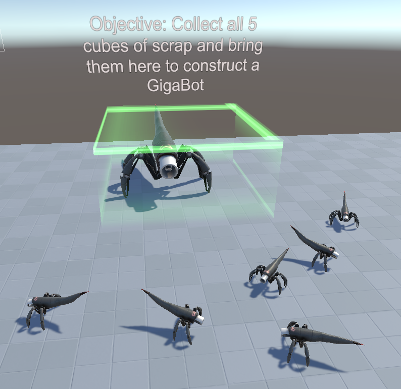
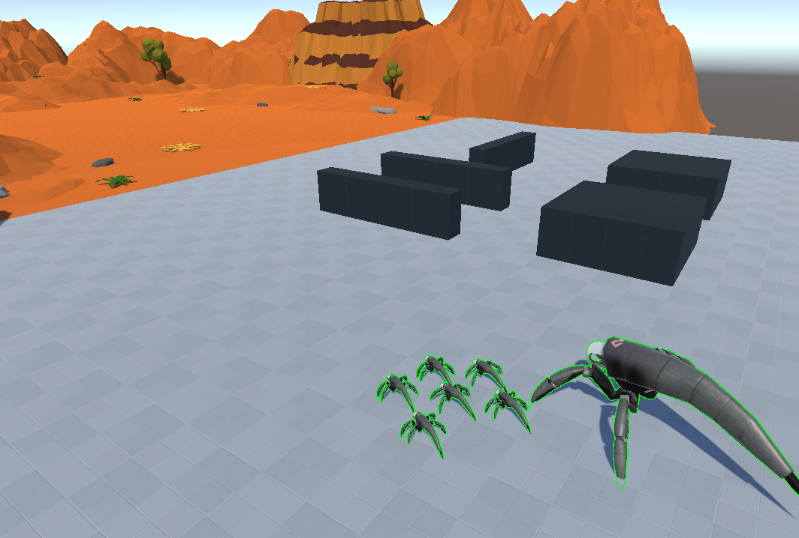

# COMP210_2_AR VR Task

## VR game proposal
Main game concept:
RTS vr game, control and command robot workers to build factories in order to build more robots.
Main objective is to build a giant robot by having your smaller robot minions to construct giant robot parts to then assemble the giant robot to attack the enemy and win the game.

prototype concept:
simple VR scene in which you can move around the scene and interact with some robot units, give them movement commands and be able to pick them up and throw them around the scene.

## VR Market and similair games
There's already quite a few RTS game out there, here of some of them that have similair game mechanics to the game I want to make.
RTS vr games:
- AirMech Command
- Brass Tactics
- Skyworld

RTS games that are non VR:
- Planetary annihilation
- Supreme Commander 2

## Key requirments the prototype must fufill:
These are the key requirments the prototype must fufill to be complete prototype that shows off the main aspects of the kind of game it could be built into.
- RTS type controls using the Vive controllers (area unit selection, point command to move units to position)
- Player can pick up units from the ground and place them somewhere else using the Vive Controllers
- Units can move around and avoid obstacles using to AI

### User stories
These are the user stroies for the prototype I will be developing:
- As a player I should be able to select specific units that I want to command
- As a player I should be able to be able to identify which units I have selected
- As a player I should be able to command my AI units
- As a player I should be able to pickup individual units
- As a player I should be able to throw the unit I have in my hand

### Control scheme using Vive controllers

2.Track Pad - Teleportation

7.Trigger - Unit selecting (click once for single unit selecting - hold for multi unnit selecting)

8.Grip Button - Move to position command

- Teleportation: allows the player to move around the map by teleporting to specific locations
- Unit selecting: allows the player to select specific units or a group of units
- Move to position command: moves a single or multiple untis to a position defined by the player

### stretch Goals:
- Units can contruct buildings/factories
- Units can carry and move around resources for construction - Done!
- Have the units work on building a bigger robot - Done!
- A bigger robot unit you can control - Done!
- a win and lose state to the game
- have ennemy robots that come to attack you
- defense system to defend against enemy robots

## Look of the game
I intend for the final game to have a similair look/asthetic to Planetary annihilation and AirMech.
The protoype will use whatever assets I can find available for free on the asset store, hopefully in a simiair art style.
[AirMech Command video link](https://www.youtube.com/watch?v=hL-8GeuDPzI)

### List of assets I used from the Unity asset store
- https://assetstore.unity.com/packages/3d/environments/landscapes/lowpoly-environment-pack-99479
- https://assetstore.unity.com/packages/3d/characters/robots/scifi-enemies-and-vehicles-15159
- https://assetstore.unity.com/packages/tools/integration/steamvr-plugin-32647

### Commit Log

## Screenshots of the game

